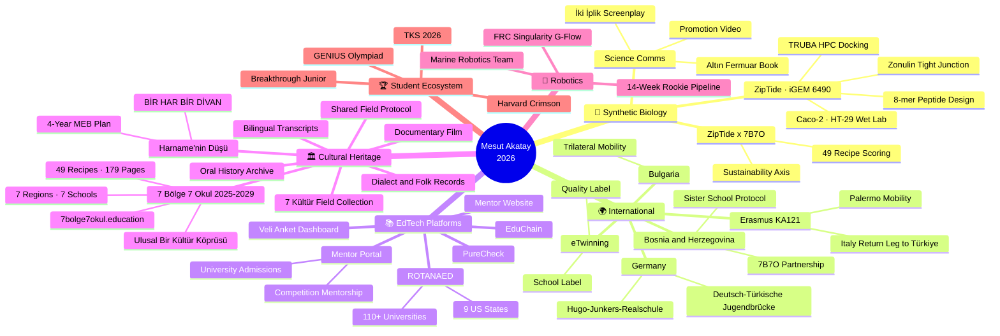
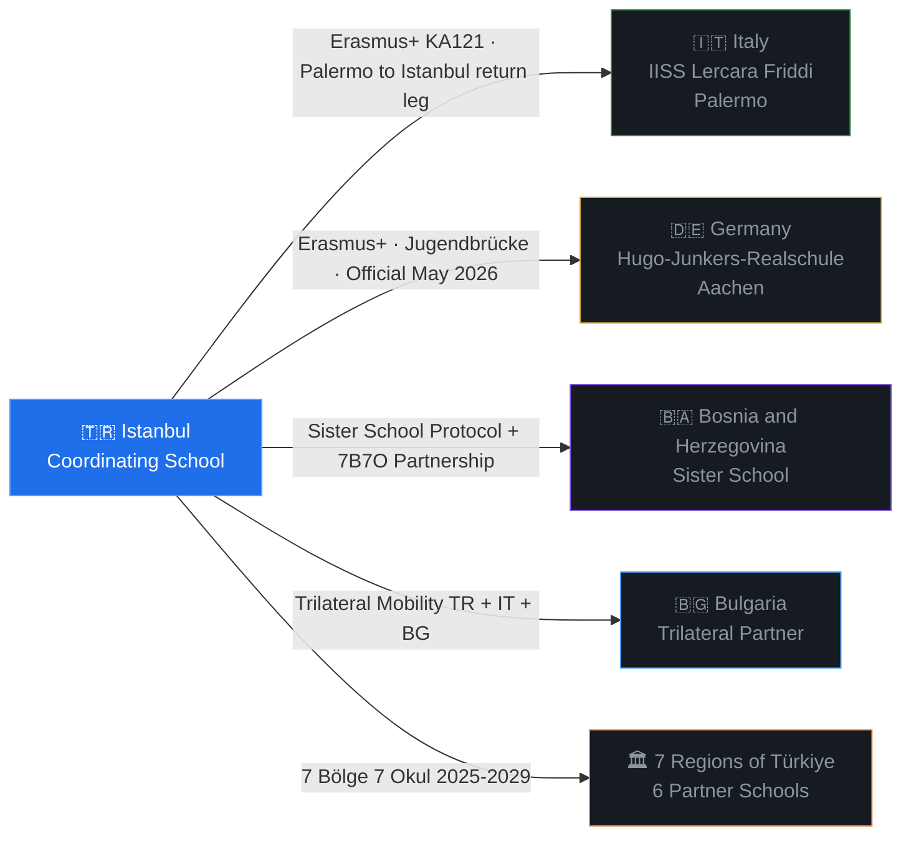
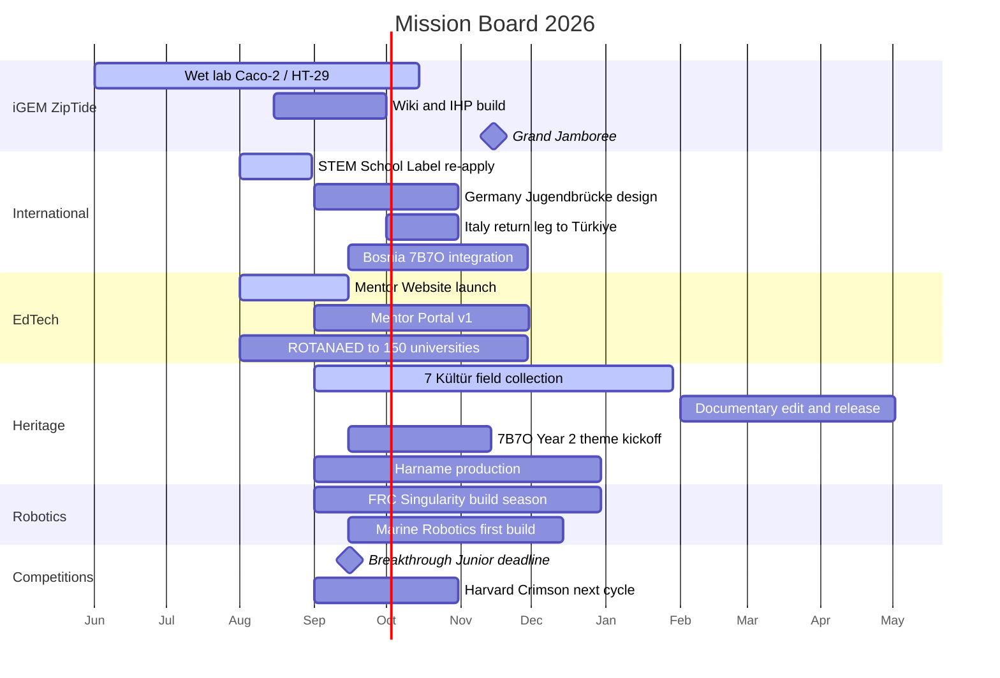

<div align="center">

<!-- Animated Header -->


<!-- Typing Animation -->
<a href="https://git.io/typing-svg"></a>

<br/>

> *"Information is power. But like all power, there are those who want to keep it for themselves."*
> — **Aaron Swartz** (1986–2013)

<br/>


[](https://github.com/ByX0000)
[](https://github.com/ByX0000)

<br/>


</div>

---

<div align="center">

## 🌊 `whoami`

</div>

```
┌──────────────────────────────────────────────────────────────────────┐
│                                                                      │
│   $ cat /home/mesut/identity.yml                                     │
│                                                                      │
│   name: "Mesut Akatay"                                               │
│   location: "Istanbul, Türkiye 🇹🇷"                                  │
│   role: "Turkish Language & Literature Teacher"                      │
│   title: "International Projects Coordinator"                        │
│   school: "Public Anatolian High School, Kadıköy / Istanbul"         │
│   education:                                                         │
│     - degree: "Türk Dili ve Edebiyatı"                               │
│       university: "Çukurova Üniversitesi"                            │
│     - degree: "Adalet (Associate)"                                   │
│     - degree: "Laborantlık (Associate)"                              │
│   domains:                                                           │
│     - synthetic_biology   # iGEM 2026 · ZipTide                      │
│     - robotics            # FRC + Marine Robotics                    │
│     - international_ed    # Erasmus+ · eTwinning · Jugendbrücke      │
│     - cultural_heritage   # 7 Bölge 7 Okul (2025–2029)               │
│     - edtech              # ROTANAED · Mentor Portal · EduChain      │
│     - generative_media    # AI film, data art, book production       │
│   philosophy: "Build at the intersection of education, AI & science" │
│   github: "ByX0000"                                                  │
│   motto: "Scientia potentia est, but only when shared."              │
│                                                                      │
└──────────────────────────────────────────────────────────────────────┘
```

I'm a high school teacher from Istanbul who refuses to accept that the classroom has walls. I build tools, coordinate international projects, advise robotics and synthetic biology teams, write code, produce AI-animated films, and develop open-source educational technology, all while teaching Turkish literature to teenagers who are probably smarter than me.

My work lives at the crossroads of **education**, **artificial intelligence**, **synthetic biology**, and **open knowledge**. A teacher's job isn't to fill minds; it's to open doors. And if those doors don't exist yet, we build them.

I come from a background in **literary writing and journalism** (Evrensel gazetesi, Uluslararası Çukurova Sanat Girişimi). I carry the same storytelling discipline into code: every project should tell a story, every interface should have a narrative, and every dataset should whisper its secrets to those who listen carefully.

<div align="center">

</div>

---

<div align="center">

## 📦 Shipping Log · Last 60 Days

*June 14 → August 14, 2026*

</div>

| 🗓 | Deliverable | Domain | Status |
|:--|:--|:--|:--|
| **Jun 17** | **"Ulusal Bir Kültür Köprüsü"** published. Year-1 output of 7 Bölge 7 Okul: 179 pages, 49 recipes, bilingual, Canva production pipeline | Cultural Heritage | ✅ Shipped |
| **Jun 8–13** | **GENIUS Olympiad** finals in Rochester, NY. Team *Çeşme-i Hayat* competing; Turkish finalist guide translated and distributed | Competitions | ✅ Completed |
| **Jun** | **ZipTide × 7B7O sub-project**: 49 recipes scored on gut-support and sustainability axes, two-layer referencing rule, sensitivity analysis instead of citation-per-weight | iGEM + Heritage | ✅ Shipped |
| **Jun** | **"ZipTide ve Altın Fermuar"** children's picture book. 8 scenes, Nano Banana pipeline, typeset PDF | Science Comms | ✅ Shipped |
| **Jun** | **8-mer Design Space** generative data-art piece. 2,220,075 compositions across a 20⁸ sequence universe, entropy-reveal animation | Data Art | ✅ Shipped |
| **Jul** | **Wet lab at YTÜ MBG** (Caco-2 / HT-29), docking runs on TRUBA HPC, zonulin and tight-junction pathway targeting locked in | Synthetic Biology | 🔬 Running |
| **Jul 30** | **iGEM Stage II Finalization** + Jamboree ticketing completed for Team #6490, Türkiye's only 2026 team | iGEM | ✅ Cleared |
| **Aug 12** | **ZipTide Project Promotion Video** submitted. Storyboards, WebVTT captions, editor guides produced in-house | iGEM | ✅ Submitted |
| **Aug** | **"İki İplik" bilingual screenplay format** finalized and filed as an official **iGEM Contribution** | iGEM | ✅ Submitted |
| **Aug** | **TKS 2026 acceptances** announced and disseminated through individual student graphics | Student Success | ✅ Done |
| **Aug** | **STEM School Label** re-application window opened. Previous cycle scored 56/100; 21-criteria gap analysis complete | Institutional | 🔄 In progress |
| **Ongoing** | **EduChain**, blockchain-based certificate verification, deployed | EdTech | 🟢 Live |
| **Ongoing** | **Veli Memnuniyet Anketi** dashboard deployed on Netlify | EdTech | 🟢 Live |
| **Ongoing** | **7bolge7okul.education** self-hosted on Hetzner | Infrastructure | 🟢 Live |
| **Ongoing** | **Mentor Website + Mentor Portal** build. University guidance and competition mentorship platform | EdTech | 🏗 Building |
| **Ongoing** | **MEB Proje Okulu Report**, 20 sections in 5 parts. Section 5 and front matter complete | Institutional | 🏗 Building |
| **Ongoing** | **Marine Robotics Team** founded; **FRC Singularity G-Flow** founding underway with Fikret Yüksel Vakfı sponsorship | Robotics | 🏗 Building |
| **Ongoing** | **PureCheck** cosmetic-ingredient app architecture, eight design invariants defined | Product Design | 📐 Spec |

---

<div align="center">

## 🗺 Project Map

</div>



---

<div align="center">

## ⚡ Tech Arsenal

### 🔤 Languages & Markup


### ⚛️ Frontend & Frameworks


### 🤖 AI / ML / LLM


### 🧬 Bioinformatics & HPC


### 🎨 Creative, 3D & Publishing


### 🤖 Robotics


### 🛠 DevOps & Infrastructure


</div>

---

<div align="center">

## 🚀 What I'm Currently Building
<tr>
<td width="50%" valign="top">

### 🎥 7 Bölge 7 Kültür — Field Collection & Documentary
**Oral history, recorded by the people who live it**

A fieldwork strand running inside the 7 Bölge 7 Okul framework. Student teams across Türkiye's seven regions collect what does not survive in textbooks: dialect samples, folk songs, craft techniques, kitchen vocabulary, migration stories, and the small rituals that carry a region's memory.

Every partner school works from a shared field protocol so the material stays comparable across regions: interview guide, consent forms, audio and video capture standards, metadata sheet, transcription and translation templates. Everything is archived with full source attribution and released bilingually.

The output is a **documentary film** cut from the seven regional archives, plus a searchable field-collection corpus that later project years build on. Culture documented from inside, not about.

**Layers:** field protocol · student fieldwork · archive · transcription · documentary edit · bilingual release.

</td>
<td width="50%" valign="top">

*(buraya mevcut bir kartı taşı ya da yeni bir kart ekle)*

</td>
</tr>

</div>

<table>
<tr>
<td width="50%" valign="top">

### 🧬 ZipTide — iGEM 2026
**Team #6490 · Türkiye's only team this cycle**

An 8-mer peptide design program targeting the **zonulin / tight junction pathway**, built by high school students. Wet lab runs on **Caco-2** and **HT-29** cell lines at YTÜ Molecular Biology & Genetics under Prof. Nehir Özdemir Özgentürk, with molecular docking on the **TRUBA** national HPC cluster.

Beyond the bench: a promotion video, a children's picture book, a bilingual screenplay format filed as an official iGEM **Contribution**, and a generative visualization of the complete 8-mer design space at **2,220,075 compositions**.

*When a literature teacher's students start designing peptides, something is going right in education.*

</td>
<td width="50%" valign="top">

### 🎓 Mentor Website & Mentor Portal
**Guidance infrastructure, not a brochure**

A two-layer platform. The **public mentor website** carries the program, methodology, and application flow. The **mentor portal** is the working surface: student profiles, competition pipelines, university shortlists, deadline tracking, document versioning, and mentor notes in one place.

Built for the gap I keep hitting in practice. Turkish students competing internationally need continuity between people, not scattered WhatsApp threads. The portal turns mentorship into something that survives handoffs.

**Modules:** admissions timeline · competition tracker · essay review loop · recommendation-letter pipeline · scholarship matrix.

</td>
</tr>
<tr>
<td width="50%" valign="top">

### 🇮🇹 Erasmus+ KA121 — Italy Circuit
**Palermo out, Türkiye back**

Outbound mobility to **IISS Lercara Friddi, Palermo** (April 20–25) as a trilateral **TR + IT + BG** activity, delivered in full without grant funding. Everything produced in-house: exit cards, phrase guides, mobility documentation, and a live [Erasmus Timeline web app](https://github.com/ByX0000/erasmus-timeline).

The **return leg brings Italy to Türkiye**: an Italian delegation hosted in Istanbul with a reciprocal programme built around school-to-school workshops, heritage visits, and joint classroom sessions. Reciprocity is the whole point; a one-way mobility is tourism.

</td>
<td width="50%" valign="top">

### 🇩🇪 Hugo-Junkers-Realschule Aachen
**Erasmus+ · Deutsch-Türkische Jugendbrücke**

Official since **May 2026**. A German partnership running on two rails at once: **Erasmus+** for the formal mobility framework and the **Deutsch-Türkische Jugendbrücke (DTJB)** for the youth-exchange funding and network layer.

Contact point: Frau Söküt. The announcement drew **269 likes** on our school channels, which for a partnership post is its own small signal about how much students want this.

**Track:** joint project design → student exchange → shared curriculum modules.

</td>
</tr>
<tr>
<td width="50%" valign="top">

### 🇧🇦 Bosnia and Herzegovina
**Sister School + 7 Bölge Partnership**

A sister-school protocol that grew into something structurally more interesting: Bosnia and Herzegovina joins the **7 Bölge 7 Okul** cultural heritage framework as an international partner, extending a project designed around Türkiye's seven geographic regions across the Balkans.

Shared Ottoman-era gastronomic and literary heritage makes this a natural fit rather than a diplomatic one. Year-1 gastronomy work already surfaced cross-border recipe overlaps worth documenting.

</td>
<td width="50%" valign="top">

### 🌍 7 Bölge 7 Okul
**Cultural Heritage Initiative (2025–2029)**

A four-year initiative coordinated by our school with **six partner schools across Türkiye's seven regions**, plus the Bosnia and Herzegovina partnership.

**Year 1 output shipped June 17, 2026:** *"Ulusal Bir Kültür Köprüsü"*, a **179-page bilingual gastronomy book** with **49 recipes** and Ottoman miniature illustrations, produced through a Canva pipeline.

A ZipTide sub-project scored all 49 recipes on gut-support and sustainability axes, defended through sensitivity analysis. Site: [7bolge7okul.education](https://7bolge7okul.education), self-hosted, open source.

</td>
</tr>
<tr>
<td width="50%" valign="top">

### 🤖 Robotics — Two Teams, One Pipeline
**FRC Singularity G-Flow · Marine Robotics**

**FRC:** founding a competitive team with **Fikret Yüksel Vakfı** sponsorship, following a scouting trip to the NYC Regional. A **14-week Rookie Pipeline** in four phases handles onboarding for 9th and 10th graders. Partnerships with Sultans of Turkiye (2905) and IstanBULLS (6064).

**Marine Robotics:** a second team founded this year, led by student Ahmet Kaan Yıldız, opening an underwater track alongside the FRC line.

*Two TÜBİTAK first-place awards from a previous institution. Building that legacy forward here.*

</td>
<td width="50%" valign="top">

### 📱 ROTANAED
**US University Guidance System**

**110+ universities** documented across **9 US states** (MA, CA, TX, NY, PA, NJ, IL, CT, MD/DC). Each institution gets a full-format Word guide plus a structured JSON record for the app layer.

Current work: Maryland/DC completion and migrating the JSON corpus to a unified template schema. Built for Turkish families navigating the American admissions labyrinth without a $300/hour consultant.

*The tool every Turkish high schooler dreaming of America deserves, and none of them have.*

</td>
</tr>
<tr>
<td width="50%" valign="top">

### 🎬 Harname'nin Düşü
**AI-Animated Film · BİR HAR BİR DİVAN**

An AI-animated adaptation of Şeyhî's 15th-century satirical poem *Harnâme*, running as a four-year MEB action plan (institution code 964176).

Pipeline: screenplay (Claude) → character design (Nano Banana / Element Library) → scene visuals → animation (Higgsfield) → editing (CapCut) → audio → render. Character consistency is held through the Element Library with @mention syntax.

*A 600-year-old donkey's dream, rendered by machines that dream in pixels.*

</td>
<td width="50%" valign="top">

### 🧪 EdTech & Lab Bench
**EduChain · Veli Anket · PureCheck · BioLLM**

**EduChain:** blockchain certificate verification, live. **Veli Memnuniyet Anketi:** a parent-satisfaction dashboard on Netlify. **PureCheck:** a cosmetic-ingredient app spec built on eight invariants, with hazard-versus-risk separation as its core distinction. **BioLLM:** biological signal to language-model modulation, from simulation through EMG hardware.

</td>
</tr>
<tr>
<td width="50%" valign="top">

### 🏫 School Innovation Hub
**Erasmus+ · eTwinning · STEM Label · Proje Okulu**

**665 students**, **16 MEB clubs** in 5 thematic areas, plus a *Topluluklar Kulübü* pilot with **350 students** across **20 communities** in 6 categories.

STEM School Label scored **56/100** last cycle; the August 2026 re-application is mapped against all **21 criteria**. The **MEB Proje Okulu Report** runs 20 sections in 5 parts, with Section 5 and front matter complete.

</td>
<td width="50%" valign="top">

### 🏆 Student Competition Ecosystem
**Global Recognition**

**Lal Neva Erdem:** 2nd globally in Harvard Crimson (Argumentative), 1st in MENA + Africa, admitted to Harvard Summer Journalism Academy. **Zeynep Alya Alkaya:** MENA + Africa finalist. **Çeşme-i Hayat:** GENIUS Olympiad finalist, Rochester NY. **TKS 2026:** multiple acceptances. Plus Game Jam 2nd place (İstanbul Aydın, *Robogun*) and a Behçet Necatigil Poetry finalist.

**Next target:** Breakthrough Junior Challenge, September 15, 2026.

</td>
</tr>
</table>

---

<div align="center">

## 🌐 International Partnership Network

</div>



| Partner | Country | Framework | Status |
|:--|:--|:--|:--|
| IISS Lercara Friddi, Palermo | 🇮🇹 Italy | Erasmus+ KA121, trilateral TR+IT+BG | Outbound completed, **return leg to Türkiye in planning** |
| Hugo-Junkers-Realschule, Aachen | 🇩🇪 Germany | Erasmus+ · Deutsch-Türkische Jugendbrücke | **Official since May 2026** |
| Sister school, Bosnia and Herzegovina | 🇧🇦 BiH | Protocol + 7 Bölge 7 Okul partnership | Active |
| Bulgarian partner school | 🇧🇬 Bulgaria | Trilateral mobility | Active |
| Six schools, seven regions | 🇹🇷 Türkiye | 7 Bölge 7 Okul, eTwinning, TÜBİTAK 2204-A | Year 1 delivered |

---

<div align="center">

## 📚 Selected Repositories

</div>

| Repo | What it is | Stack |
|:--|:--|:--|
| [`erasmus-timeline`](https://github.com/ByX0000/erasmus-timeline) | Interactive mobility timeline for the Palermo KA121 activity | JS · Vercel |
| [`educhaingikal`](https://github.com/ByX0000/educhaingikal) | Blockchain-based certificate verification for school credentials | JS · Web3 |
| [`veli-anket-gikal`](https://github.com/ByX0000/veli-anket-gikal) | Parent satisfaction survey dashboard | JS · Netlify |
| `7bolge7okul` | Cultural heritage project site, self-hosted | HTML · Hetzner |
| `mentor-website` | Public face of the mentorship programme | React · Tailwind |
| `mentor-portal` | Student pipeline, deadlines, document tracking | React · Node |
| `rotanaed` | US university guidance corpus, 110+ institutions | Python · JSON |

---

<div align="center">

## 🧰 Custom Agent Skills

*Reusable domain modules written for my own workflow*


</div>

Domain modules covering Erasmus+ application drafting, eTwinning quality-label workflows, FRC engineering guidance, bioinformatics analysis, university guide production, cross-modal data transduction (`tercuman`), cinematic AI production (`kare-kare`), and divergent ideation (`mor-cagrisim`). Every one started as a workflow I was repeating by hand too many times.

---

<div align="center">

## 📊 GitHub Analytics


</div>

---

<div align="center">

## 🏆 Trophies


</div>

---

<div align="center">

## 🐍 Contribution Snake

<picture>
  <source media="(prefers-color-scheme: dark)" srcset="https://raw.githubusercontent.com/ByX0000/ByX0000/output/github-contribution-grid-snake-dark.svg" />
  <source media="(prefers-color-scheme: light)" srcset="https://raw.githubusercontent.com/ByX0000/ByX0000/output/github-contribution-grid-snake.svg" />
  
</picture>

*Set up with [snk](https://github.com/Platane/snk) GitHub Action, because contributions should slither across the screen.*

</div>

---

<div align="center">

## ✊ Standing on the Shoulders of Giants

</div>

This work is only possible because others fought for the idea that **knowledge should be free**. Every line of code I write, every project I coordinate, every student I guide toward international competitions traces back to people who believed information shouldn't be locked behind walls.

<table>
<tr>
<td align="center" width="20%">
<br/>
<strong>Aaron Swartz</strong><br/>
<em>1986–2013</em><br/><br/>
Co-creator of RSS, Reddit, Creative Commons. Arrested for downloading academic papers that should have been free. Died fighting for open access. His Guerilla Open Access Manifesto remains a moral compass: <em>"There is no justice in following unjust laws."</em>
</td>
<td align="center" width="20%">
<br/>
<strong>Satoshi Nakamoto</strong><br/>
<em>Identity unknown</em><br/><br/>
Proved that the most revolutionary act in technology can be anonymous. Created Bitcoin, then vanished, leaving behind a protocol rather than a personality. The ultimate open-source contribution: build something that changes the world, then let the world have it.
</td>
<td align="center" width="20%">
<br/>
<strong>Richard Stallman</strong><br/>
<em>b. 1953</em><br/><br/>
Founded the Free Software Foundation, wrote the GPL, created GNU. Before "open source" was a buzzword, Stallman was writing manifestos about why software must be free. Uncompromising, eccentric, essential.
</td>
<td align="center" width="20%">
<br/>
<strong>Linus Torvalds</strong><br/>
<em>b. 1969</em><br/><br/>
Created Linux and Git, two tools that literally run the modern internet. Proved that a Finnish student's hobby project could become the backbone of global infrastructure. Every <code>git push</code> is a thank-you note.
</td>
<td align="center" width="20%">
<br/>
<strong>Alexandra Elbakyan</strong><br/>
<em>b. 1988</em><br/><br/>
Created Sci-Hub, the "Pirate Bay of science." Made 85+ million research papers freely accessible. Called a criminal by publishers, a hero by researchers worldwide. Continued Aaron Swartz's unfinished fight.
</td>
</tr>
</table>

<div align="center">

> *"We need to take information, wherever it is stored, make our copies and share them with the world."*
> — **Aaron Swartz**, Guerilla Open Access Manifesto (2008)

> *"If you want to change the world, don't protest. Write code."*
> — Attributed to various cypherpunks

> *"The Times 03/Jan/2009 Chancellor on brink of second bailout for banks"*
> — **Satoshi Nakamoto**, Bitcoin Genesis Block

</div>

---

<div align="center">

## 🧭 My Open Source Philosophy

</div>

```
┌─────────────────────────────────────────────────────────────────────────┐
│                                                                         │
│   I am a teacher. Teachers are the original open-source contributors.   │
│                                                                         │
│   Every lesson plan is a fork. Every classroom is a pull request        │
│   against ignorance. Every student who learns something new             │
│   is a successful deployment.                                           │
│                                                                         │
│   The best code, like the best education, is:                           │
│     → freely available                                                  │
│     → well-documented                                                   │
│     → open to improvement                                               │
│     → designed to be forked                                             │
│                                                                         │
│   I build tools for students who can't afford expensive software.       │
│   I write guides for families navigating college admissions alone.      │
│   I create platforms that connect schools across borders.               │
│                                                                         │
│   This is not charity. This is infrastructure.                          │
│                                                                         │
│   12+ open-source repositories and counting.                            │
│   Every one of them a small act of resistance against the idea          │
│   that knowledge has a price tag.                                       │
│                                                                         │
│   Fork everything. Share everything. Build everything.                  │
│                                                                         │
└─────────────────────────────────────────────────────────────────────────┘
```

---

<div align="center">

## 🎯 Roadmap · 2026

</div>



---

<div align="center">

## 📬 Connect with Me

[](https://linkedin.com/in/mesutakatay)
[](https://github.com/ByX0000)
[](mailto:mesutakatay@gmail.com)

---

### 💬 Open to

🤝 **Erasmus+ partnerships**, especially Mediterranean, Balkans and German-speaking schools
🧬 **iGEM collaborations**, high school teams and university mentorship alike
🤖 **FRC and marine robotics mentorship** for rookie teams in Türkiye
📚 **EdTech co-development**: university guidance, mentorship portals, student dashboards
🏛 **Cultural heritage projects** with a digital publishing layer
🎨 **Creative projects**: AI animation, generative art, cross-modal data art

---

<br/>

*"A teacher affects eternity; he can never tell where his influence stops."*
— Henry Adams

<br/>


</div>
