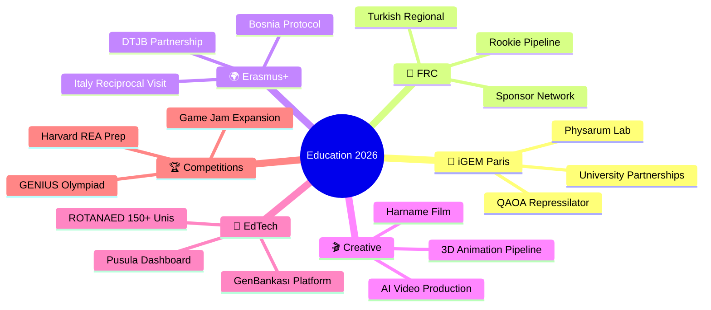

<div align="center">

<!-- Animated Header -->


<!-- Typing Animation -->
<a href="https://git.io/typing-svg"></a>

<br/>

<!-- Quote Block -->
> *"Information is power. But like all power, there are those who want to keep it for themselves."*
> — **Aaron Swartz** (1986–2013)

<br/>

<!-- Profile Views & Stats -->

[](https://github.com/ByX0000)
[](https://github.com/ByX0000)

</div>

---

<div align="center">

## 🌊 `whoami`

</div>

```
┌──────────────────────────────────────────────────────────────────────┐
│                                                                      │
│   $ cat /home/mesut/identity.yml                                     │
│                                                                      │
│   name: "Mesut Akatay"                                               │
│   location: "Istanbul, Türkiye 🇹🇷"                                  │
│   role: "Turkish Language & Literature Teacher"                      │
│   title: "International Projects Coordinator"                        │
│   school: "Public Anatolian High School, Istanbul"                  │
│   education:                                                         │
│     - degree: "Türk Dili ve Edebiyatı"                               │
│       university: "Çukurova Üniversitesi"                            │
│     - degree: "Adalet (Associate)"                                   │
│     - degree: "Laborantlık (Associate)"                              │
│   philosophy: "Build at the intersection of education, AI & science" │
│   github: "ByX0000"                                                  │
│   motto: "Scientia potentia est — but only when shared."             │
│                                                                      │
└──────────────────────────────────────────────────────────────────────┘
```

I'm a high school teacher from Istanbul who refuses to accept that the classroom has walls. I build tools, coordinate international projects, advise robotics and synthetic biology teams, write code, produce AI-animated films, and develop open-source educational technology — all while teaching Turkish literature to teenagers who are probably smarter than me.

My work lives at the crossroads of **education**, **artificial intelligence**, **synthetic biology**, and **open knowledge**. I believe that a teacher's job isn't to fill minds — it's to open doors. And if those doors don't exist yet, we build them.

I come from a background in **literary writing and journalism** (Evrensel gazetesi, Uluslararası Çukurova Sanat Girişimi). I carry the same storytelling discipline into code: every project should tell a story, every interface should have a narrative, and every dataset should whisper its secrets to those who listen carefully.

<div align="center">

</div>

---

<div align="center">

## ⚡ Tech Arsenal

</div>

<div align="center">

### 🔤 Languages & Markup


### 🤖 AI / ML / LLM


### 🧬 Bioinformatics & Quantum


### 🎨 Creative & 3D


### 🤖 Robotics


### 🛠 DevOps & Tools


</div>

---

<div align="center">

## 🚀 What I'm Currently Building

</div>

<table>
<tr>
<td width="50%" valign="top">

### 🏫 Education — School Innovation Hub
**Erasmus+ KA121 · eTwinning · STEM School Label**

The nerve center. I coordinate Erasmus+ mobilities, 20+ eTwinning projects, STEM School Label applications, and institutional development for a public Anatolian high school in Kadıköy. Recent highlight: KA121 mobility to Palermo (IISS Lercara Friddi), with full documentation deployed as a [live Vercel web app](https://github.com/ByX0000/erasmus-timeline). Sister school protocols with Bosnia-Herzegovina. Italian reciprocal visit planned for October 2026 (12 students + 3 teachers).

**665 students** across **16 MEB clubs** in **5 thematic areas**. Plus a pilot "Topluluklar Kulübü" with **350 students** and **20 communities**.

</td>
<td width="50%" valign="top">

### 🧪 QuanGen — iGEM 2026
**Quantum-Assisted Repressilator Optimization**

Our team is building a quantum-assisted genetic circuit optimizer using QAOA algorithms. Target: **iGEM 2026 Grand Jamboree** in Paris (November 13–16). We're running wet-lab protocols with *Physarum polycephalum* while simultaneously developing quantum computing pipelines. Partnerships in progress with İTÜ GALEN, Marmara University, and Acıbadem.

*When a literature teacher's students start optimizing repressilators with quantum algorithms, something beautiful is happening in education.*

</td>
</tr>
<tr>
<td width="50%" valign="top">

### 🤖 FRC REEFSCAPE — School Robotics
**Founder & Advisor**

Founded my school's FIRST Robotics Competition team from scratch. Four students competed at the NYC Regional in 2025. Built a comprehensive **14-week Rookie Pipeline** framework for onboarding 9th–10th graders. Strategic partnerships with Sultans of Turkiye (Team 2905) and IstanBULLS (Team 6064). Next target: competing in a Turkish Regional under our own banner.

*Two TÜBİTAK first-place awards from previous school. Building that legacy forward.*

</td>
<td width="50%" valign="top">

### 🌍 7 Bölge 7 Okul
**Cultural Heritage Initiative (2025–2029)**

A 4-year cultural heritage project coordinated by our school with 6 partner schools across Turkey's 7 geographic regions. Year 1 output: **"Anadolu Sofrası"** — a bilingual gastronomy book with 49 recipes and Ottoman miniature illustrations. Website: [7bolge7okul.education](https://7bolge7okul.education) (open source, coded by me). Simultaneously runs as eTwinning project and TÜBİTAK 2204-A project.

</td>
</tr>
<tr>
<td width="50%" valign="top">

### 🎬 Harname'nin Düşü
**AI-Animated Film Project**

An AI-animated film adaptation of Şeyhi's 15th-century satirical poem *Harname*. 7-stage pipeline: Screenplay (Claude AI) → Character design (Nano Banana / Element Library) → Scene visuals → Animation (Higgsfield AI) → Editing (CapCut) → Audio/music → Final render. Character consistency via Higgsfield Element Library with @mention syntax.

*A 600-year-old donkey's dream, rendered by machines that dream in pixels.*

</td>
<td width="50%" valign="top">

### 📱 ROTANAED
**US University Guidance App**

A comprehensive university guidance system covering **110+ universities** across **8 US states** (MA, CA, TX, NY, PA, IL, CT, MD/DC). Each university gets a detailed Word guide + JSON data file. Currently building out the Maryland/DC series. Designed for Turkish students navigating the American admissions labyrinth.

*The app that every Turkish high schooler dreaming of America deserves — and none of them have.*

</td>
</tr>
<tr>
<td width="50%" valign="top">

### 🧫 BioLab Projects
**Physarum · WiFi CSI · PoID**

**Physarum Robotics:** Slime mold-guided decision-making systems (TÜBİTAK 2204-A candidate). **Görünmez Doktor:** WiFi CSI biosensor project for non-invasive health monitoring. **PoID:** Blockchain-based certificate verification system. **GenBankası:** Bioinformatics platform integrating AI workflows.

</td>
<td width="50%" valign="top">

### 🎓 Student Competition Ecosystem
**Global Recognition**

**Lal Neva Erdem:** 2nd globally, Harvard Crimson Global Essay Competition → Harvard Summer Journalism Course. **Game Jam:** 2nd place at İstanbul Aydın Üniversitesi (game: "Robogun"). **Behçet Necatigil Poetry Competition** finalist. **School Art Competition** finalist. **GENIUS Olympiad** finalist (Rochester, NY, June 2026).

</td>
</tr>
</table>

---

<div align="center">

## 📊 GitHub Analytics


</div>

---

<div align="center">

## 🏆 Trophies


</div>

---

<div align="center">

## 🐍 Contribution Snake

<picture>
  <source media="(prefers-color-scheme: dark)" srcset="https://raw.githubusercontent.com/ByX0000/ByX0000/output/github-contribution-grid-snake-dark.svg" />
  <source media="(prefers-color-scheme: light)" srcset="https://raw.githubusercontent.com/ByX0000/ByX0000/output/github-contribution-grid-snake.svg" />
  
</picture>

*Set up with [snk](https://github.com/Platane/snk) GitHub Action — because contributions should slither across the screen.*

</div>

---

<div align="center">

## ✊ Standing on the Shoulders of Giants

</div>

This work is only possible because others fought for the idea that **knowledge should be free**. Every line of code I write, every project I coordinate, every student I guide toward international competitions — all of it traces back to people who believed that information shouldn't be locked behind walls.

<table>
<tr>
<td align="center" width="20%">
<br/>
<strong>Aaron Swartz</strong><br/>
<em>1986–2013</em><br/><br/>
Co-creator of RSS, Reddit, Creative Commons. Arrested for downloading academic papers that should have been free. Died fighting for open access. His Guerilla Open Access Manifesto remains a moral compass: <em>"There is no justice in following unjust laws."</em>
</td>
<td align="center" width="20%">
<br/>
<strong>Satoshi Nakamoto</strong><br/>
<em>Identity unknown</em><br/><br/>
Proved that the most revolutionary act in technology can be anonymous. Created Bitcoin, then vanished — leaving behind a protocol, not a personality. The ultimate open-source contribution: build something that changes the world, then let the world have it.
</td>
<td align="center" width="20%">
<br/>
<strong>Richard Stallman</strong><br/>
<em>b. 1953</em><br/><br/>
Founded the Free Software Foundation, wrote the GPL, created GNU. Before "open source" was a buzzword, Stallman was writing manifestos about why software must be free. Uncompromising, eccentric, essential.
</td>
<td align="center" width="20%">
<br/>
<strong>Linus Torvalds</strong><br/>
<em>b. 1969</em><br/><br/>
Created Linux and Git — two tools that literally run the modern internet. Proved that a Finnish student's hobby project could become the backbone of global infrastructure. Every `git push` is a thank-you note.
</td>
<td align="center" width="20%">
<br/>
<strong>Alexandra Elbakyan</strong><br/>
<em>b. 1988</em><br/><br/>
Created Sci-Hub, the "Pirate Bay of science." Made 85+ million research papers freely accessible. Called a criminal by publishers, a hero by researchers worldwide. Continued Aaron Swartz's unfinished fight.
</td>
</tr>
</table>

<div align="center">

> *"We need to take information, wherever it is stored, make our copies and share them with the world."*
> — **Aaron Swartz**, Guerilla Open Access Manifesto (2008)

> *"If you want to change the world, don't protest. Write code."*
> — Attributed to various cypherpunks

> *"The Times 03/Jan/2009 Chancellor on brink of second bailout for banks"*
> — **Satoshi Nakamoto**, Bitcoin Genesis Block

</div>

---

<div align="center">

## 🧭 My Open Source Philosophy

</div>

```
┌─────────────────────────────────────────────────────────────────────────┐
│                                                                         │
│   I am a teacher. Teachers are the original open-source contributors.   │
│                                                                         │
│   Every lesson plan is a fork. Every classroom is a pull request         │
│   against ignorance. Every student who learns something new              │
│   is a successful deployment.                                            │
│                                                                         │
│   The best code, like the best education, is:                            │
│     → freely available                                                   │
│     → well-documented                                                    │
│     → open to improvement                                                │
│     → designed to be forked                                              │
│                                                                         │
│   I build tools for students who can't afford expensive software.        │
│   I write guides for families navigating college admissions alone.       │
│   I create platforms that connect schools across borders.                │
│                                                                         │
│   This is not charity. This is infrastructure.                           │
│                                                                         │
│   12+ open-source repositories and counting.                            │
│   Every one of them a small act of resistance against the idea           │
│   that knowledge has a price tag.                                        │
│                                                                         │
│   Fork everything. Share everything. Build everything.                   │
│                                                                         │
└─────────────────────────────────────────────────────────────────────────┘
```

---

<div align="center">

## 🎯 2025–2026 Mission Board

</div>



---

<div align="center">

## 📬 Connect with Me

[](https://linkedin.com/in/mesutakatay)
[](https://github.com/ByX0000)
[](mailto:mesutakatay@gmail.com)

---

### 💬 Open to

🤝 **Erasmus+ partnerships** — especially Mediterranean & Balkans schools
🧬 **iGEM collaborations** — synthetic biology + quantum computing crossovers
🤖 **FRC mentorship** — rookie teams in Turkey
📚 **EdTech co-development** — university guidance, student dashboards
🎨 **Creative projects** — AI animation, generative art, cross-modal data art

---

<br/>

*"A teacher affects eternity; he can never tell where his influence stops."*
— Henry Adams

<br/>

<!-- Animated Footer -->


</div>
